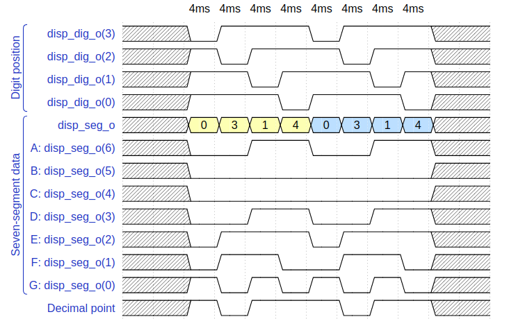

# Lab 6: Driver for seven-segment display


## Homework

1. See [reference manual](../../Docs/coolrunner-ii_rm.pdf) of the Coolrunner board, find out the connection of 7-segment display, and complete the signal timing to display `03.14` value. Note that the duration of one symbol is 4&nbsp;ms.

    &nbsp;
    
    &nbsp;

> The figure above was created in [WaveDrom](https://wavedrom.com/) digital timing diagram online tool. The figure source code is as follows:
>


## "driver_7seg" implementation

```vhdl
------------------------------------------------------------------------
--
-- Driver for seven-segment displays.
-- Xilinx XC2C256-TQ144 CPLD, ISE Design Suite 14.7
--
-- Copyright (c) 2019-2020 Tomas Fryza
-- Dept. of Radio Electronics, Brno University of Technology, Czechia
-- This work is licensed under the terms of the MIT license.
--
------------------------------------------------------------------------

library ieee;
use ieee.std_logic_1164.all;
use ieee.std_logic_unsigned.all;    -- Provides unsigned numerical computation

------------------------------------------------------------------------
-- Entity declaration for display driver
------------------------------------------------------------------------
entity driver_7seg is
port (
    clk_i    : in  std_logic;
    srst_n_i : in  std_logic;   -- Synchronous reset (active low)
    data0_i  : in  std_logic_vector(4-1 downto 0);  -- Input values
    data1_i  : in  std_logic_vector(4-1 downto 0);
    data2_i  : in  std_logic_vector(4-1 downto 0);
    data3_i  : in  std_logic_vector(4-1 downto 0);
    dp_i     : in  std_logic_vector(4-1 downto 0);  -- Decimal points

    dp_o     : out std_logic;                       -- Decimal point
    seg_o    : out std_logic_vector(7-1 downto 0);
    dig_o    : out std_logic_vector(4-1 downto 0)
);
end entity driver_7seg;

------------------------------------------------------------------------
-- Architecture declaration for display driver
------------------------------------------------------------------------
architecture Behavioral of driver_7seg is
    signal s_en  : std_logic;
    signal s_hex : std_logic_vector(4-1 downto 0);
	 signal s_dig : std_logic_vector(4-1 downto 0);
    signal s_cnt : std_logic_vector(2-1 downto 0) := "00";
begin

    --------------------------------------------------------------------
    -- Sub-block of clock_enable entity. Create s_en signal.
    --- WRITE YOUR CODE HERE
		CLOCK_ENABLE : entity work.clock_enable
		generic map (
            -- period of 4 ms = 40 * 0.1 ms ;{40 dec => 28 hex}
			g_NPERIOD => x"0028"   
		)
		port map (
			clk_i => clk_i,
			srst_n_i => srst_n_i,
			clock_enable_o => s_en
		);

    --------------------------------------------------------------------
    -- Sub-block of hex_to_7seg entity
    --- WRITE YOUR CODE HERE
		HEX_TO_7SEG : entity work.hex_to_7seg
		port map (
			hex_i => s_hex,
            seg_o => seg_o
		);

    --------------------------------------------------------------------
    -- p_select_cnt:
    -- Sequential process with synchronous reset and clock enable,
    -- which implements an internal 2-bit counter s_cnt for multiplexer
    -- selection bits.
    --------------------------------------------------------------------
    p_select_cnt : process (clk_i)
    begin
        if rising_edge(clk_i) then  -- Rising clock edge
            if srst_n_i = '0' then  -- Synchronous reset (active low)
                -- WRITE YOUR CODE HERE
				s_dig <= "1111";
            elsif s_en = '1' then
                -- WRITE YOUR CODE HERE
				if s_cnt = "11" then
					s_cnt <= "00";
				else
					s_cnt <= s_cnt + '1';
				end if;
            end if;
        end if;
    end process p_select_cnt;

    --------------------------------------------------------------------
    -- p_mux:
    -- Combinational process which implements a 4-to-1 mux.
    --------------------------------------------------------------------
    p_mux : process (s_cnt, data0_i, data1_i, data2_i, data3_i, dp_i)
    begin
        case s_cnt is
        when "00" =>
            -- WRITE YOUR CODE HERE
			s_hex <= data0_i;
			s_dig <= "1110";
			dp_o <= dp_i(0);
        when "01" =>
            -- WRITE YOUR CODE HERE
			s_hex <= data1_i;
			s_dig <= "1101";
			dp_o <= dp_i(1);
        when "10" =>
            -- WRITE YOUR CODE HERE
			s_hex <= data2_i;
			s_dig <= "1011";
			dp_o <= dp_i(2);
        when others =>
            -- WRITE YOUR CODE HERE
			s_hex <= data3_i;
			s_dig <= "0111";
			dp_o <= dp_i(3);
        end case;


    end process p_mux;

    dig_o <= s_dig;

end architecture Behavioral;
```

## Error during simulation :(

* still in progress
