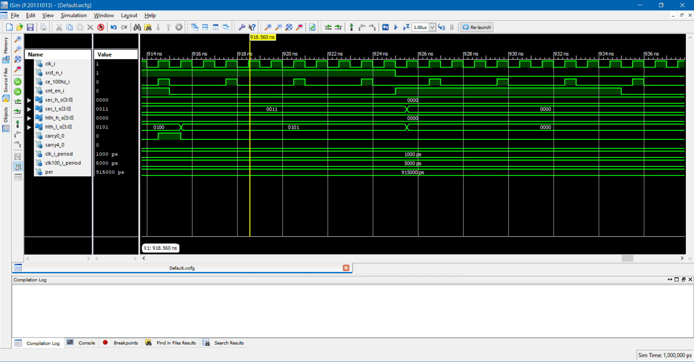
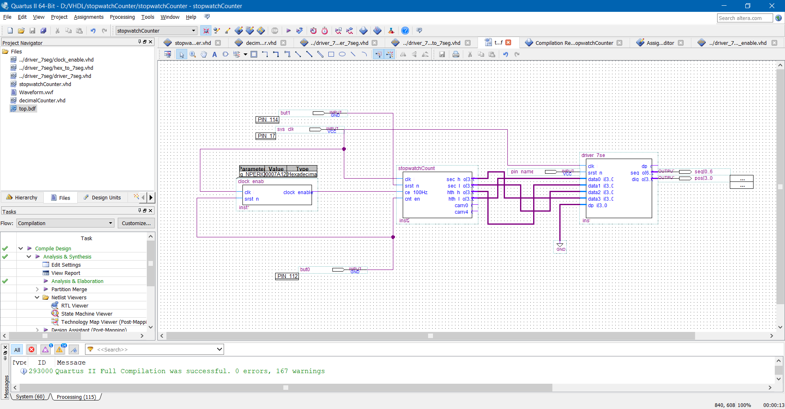
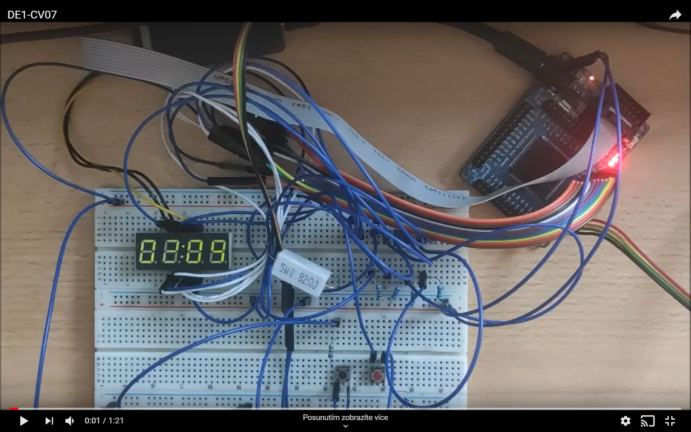

# File stopwatchCounter.vhd

```vhdl
----------------------------------------------------------------------------------
-- Company:
-- Engineer:
--
-- Create Date:    20:31:33 03/19/2020
-- Design Name:
-- Module Name:    stopwatchCounter - Behavioral
-- Project Name:
-- Target Devices:
-- Tool versions:
-- Description:
--
-- Dependencies:
--
-- Revision:
-- Revision 0.01 - File Created
-- Additional Comments:
--
----------------------------------------------------------------------------------
library ieee;
use ieee.std_logic_1164.all;
use ieee.numeric_std.all;

-- Uncomment the following library declaration if using
-- arithmetic functions with Signed or Unsigned values
--use IEEE.NUMERIC_STD.ALL;

-- Uncomment the following library declaration if instantiating
-- any Xilinx primitives in this code.
--library UNISIM;
--use UNISIM.VComponents.all;

entity stopwatchCounter is
port(
	-- outputs
	sec_h_o : out std_logic_vector(4-1 downto 0);
	sec_l_o : out std_logic_vector(4-1 downto 0);
	hth_h_o : out std_logic_vector(4-1 downto 0);
	hth_l_o : out std_logic_vector(4-1 downto 0);
	carry4_0 : out  std_logic;
	-- inputs
	clk_i    	: in  std_logic;
	srst_n_i    : in  std_logic;
	ce_100Hz_i  : in  std_logic;
	cnt_en_i    : in  std_logic
);
end stopwatchCounter;

architecture Behavioral of stopwatchCounter is
	signal s_cnt0 : std_logic_vector(4-1 downto 0);
	signal s_cnt1 : std_logic_vector(4-1 downto 0);
	signal s_cnt2 : std_logic_vector(4-1 downto 0);
	signal s_cnt3 : std_logic_vector(4-1 downto 0);

	signal s_carry0 : std_logic;
	signal s_carry1 : std_logic;
	signal s_carry2 : std_logic;
	signal s_carry3 : std_logic;
	signal s_carry4 : std_logic;
begin

	sec_h_o <= s_cnt3;
	sec_l_o <= s_cnt2;
	hth_h_o <= s_cnt1;
	hth_l_o <= s_cnt0;
	carry4_0 <= s_carry4;

	counter0 : entity work.decimalCounter
	generic map (max => 9)
	port map (
		clk_i => clk_i,
		srst_n_i => srst_n_i,
		enable_i => s_carry0,
		counter_o => s_cnt0,
		carry_o => s_carry1
	);

	counter1 : entity work.decimalCounter
	generic map (max => 9)
	port map (
		clk_i => clk_i,
		srst_n_i => srst_n_i,
		enable_i => s_carry1,
		counter_o => s_cnt1,
		carry_o => s_carry2
	);

	counter2 : entity work.decimalCounter
	generic map (max => 9)
	port map (
		clk_i => clk_i,
		srst_n_i => srst_n_i,
		enable_i => s_carry2,
		counter_o => s_cnt2,
		carry_o => s_carry3
	);

	counter3 : entity work.decimalCounter
	generic map (max => 5)
	port map (
		clk_i => clk_i,
		srst_n_i => srst_n_i,
		enable_i => s_carry3,
		counter_o => s_cnt3,
		carry_o => s_carry4
	);


	p_enable : process(clk_i)
	begin
		if rising_edge(clk_i) then
			if srst_n_i = '0' then
				s_carry0 <= '0';  
			else
				s_carry0 <= ce_100Hz_i and cnt_en_i;     
			end if;
		end if;
   end process p_enable;

end Behavioral;

```
# Component file decimalCounter.vhd

```vhdl
----------------------------------------------------------------------------------
-- Company:
-- Engineer:
--
-- Create Date:    11:43:08 03/20/2020
-- Design Name:
-- Module Name:    decimalCounter - Behavioral
-- Project Name:
-- Target Devices:
-- Tool versions:
-- Description:
--
-- Dependencies:
--
-- Revision:
-- Revision 0.01 - File Created
-- Additional Comments:
--
----------------------------------------------------------------------------------
library ieee;
use ieee.std_logic_1164.all;
use ieee.numeric_std.all;

-- Uncomment the following library declaration if using
-- arithmetic functions with Signed or Unsigned values
--use IEEE.NUMERIC_STD.ALL;

-- Uncomment the following library declaration if instantiating
-- any Xilinx primitives in this code.
--library UNISIM;
--use UNISIM.VComponents.all;

entity decimalCounter is
generic(
	max  : positive := 9
);
port (
	clk_i      : in  std_logic;
	srst_n_i   : in  std_logic;
	enable_i   : in  std_logic;
	counter_o  : out std_logic_vector(3 downto 0);
	carry_o    : out std_logic := '0'
);
end decimalCounter;

architecture Behavioral of decimalCounter is
	signal s_counter : unsigned(3 downto 0) := (others => '0');
begin
	p_decimal : process(clk_i)
	begin
		if rising_edge(clk_i) then
			carry_o <= '0';
			if srst_n_i = '0' then
				s_counter <= (others => '0');
			elsif enable_i = '1' then
				s_counter <= s_counter + 1;
				if s_counter = max then
					s_counter <= (others => '0');
					carry_o <= '1';
				end if;
			end if;
		end if;
	end process p_decimal;

	counter_o <= std_logic_vector(s_counter);

end Behavioral;
```

# SIMULATION
## Test of sequential register

## Test of reset functions


# Implementation

## top schematic


## video
[](https://www.youtube.com/watch?v=CqTHemRm_CI&feature=youtu.be)
