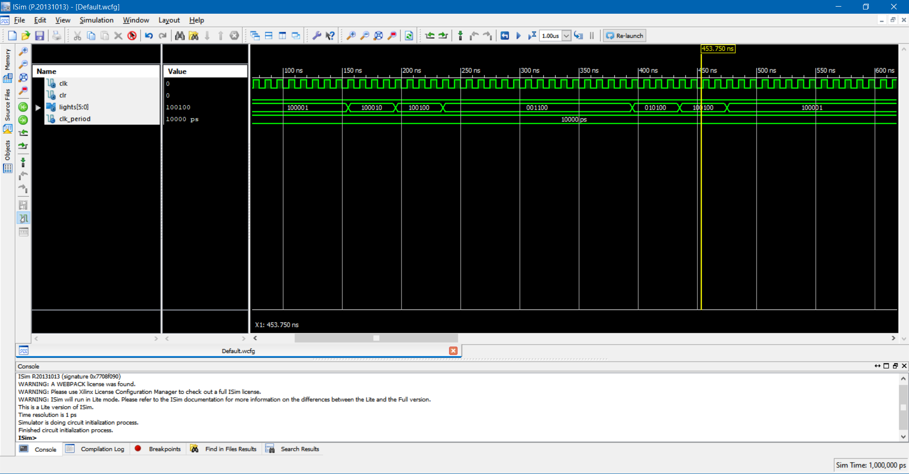
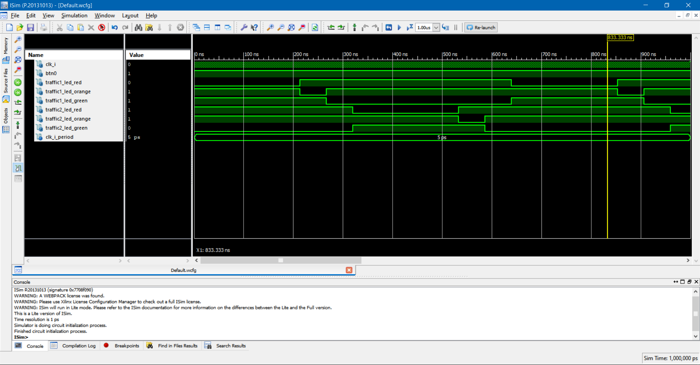

# File traffic.vhd

```vhdl
library ieee;
use ieee.std_logic_1164.all;
use ieee.numeric_std.all;


entity traffic is
	port(
				clk_i		:	in std_logic;
				clr_i		:	in std_logic;
				lights_i 	:	out std_logic_vector(5 downto 0));
end traffic;

architecture traffic of traffic is

	type state_type is (state0, state1, state2, state3, state4, state5);
	signal s_state: state_type := state0;
	signal s_count : unsigned(3 downto 0) := (others => '0');
	constant SEC5: unsigned(3 downto 0) := "1111";
	constant SEC1: unsigned(3 downto 0) := "0011";

begin
	process(clk_i, clr_i) begin
		if clr = '1' then
			s_state <= state0;
			s_count <= (others => '0');
		elsif rising_edge(clk_i) then
			case state is
				when state0 =>
					if s_count < SEC5 then
						s_state <= state0;
						s_count <= s_count + 1;
					else
						s_state <= state1;
						s_count <= (others => '0');
					end if;
				when state1 =>
					if s_count < SEC1 then
						s_state <= state1;
						s_count <= s_count + 1;
					else
						s_state <= state2;
						s_count <= (others => '0');
					end if;
				when state2 =>
					if s_count < SEC1 then
						s_state <= state2;
						s_count <= s_count + 1;
					else
						s_state <= state3;
						s_count <= (others => '0');
					end if;
				when state3 =>
					if s_count < SEC5 then
						s_state <= state3;
						s_count <= s_count + 1;
					else
						s_state <= state4;
						s_count <= (others => '0');
					end if;
				when state4 =>
					if s_count < SEC1 then
						s_state <= state4;
						s_count <= s_count + 1;
					else
						s_state <= state5;
						s_count <= (others => '0');
					end if;
				when state5 =>
					if s_count < SEC1 then
						s_state <= state5;
						s_count <= s_count + 1;
					else
						s_state <= state0;
						s_count <= (others => '0');
					end if;
				when others =>
					s_state <= state0;
			end case;
		end if;
	end process;

	C2: process(s_state)
	begin
		case state is
			when state0 => lights_i <= "100001";
			when state1 => lights_i <= "100010";
			when state2 => lights_i <= "100100";
			when state3 => lights_i <= "001100";
			when state4 => lights_i <= "010100";
			when state5 => lights_i <= "100100";
			when others => lights_i <= "100001";
		end case;
	end process;


end traffic;

```

# top.vhd

```vhdl

library IEEE;
use IEEE.STD_LOGIC_1164.ALL;

entity top is
	port(
			-- OUTPUTS
			--LD15_CPLD : out  std_logic;
			--LD14_CPLD : out  std_logic;
			--LD13_CPLD : out  std_logic;
			--LD12_CPLD : out  std_logic;
			--LD11_CPLD : out  std_logic;
			--LD10_CPLD : out  std_logic;

			TRAFFIC1_LED_RED		: out std_logic;
			TRAFFIC1_LED_ORANGE 	: out std_logic;
			TRAFFIC1_LED_GREEN	  : out std_logic;

			TRAFFIC2_LED_RED		: out std_logic;
			TRAFFIC2_LED_ORANGE	 : out std_logic;
			TRAFFIC2_LED_GREEN	  : out std_logic;

			-- INPUTS
			clk_i		: in  std_logic;
			BTN0 		: in  std_logic

			);
end top;

architecture Behavioral of top is
	signal s_lights	: std_logic_vector(5 downto 0);
	signal s_en : std_logic;
begin

	MAIN : entity work.traffic
		port map (
			clk_i => s_en,
			clr_i => not BTN0,
			lights => s_lights
		);

	CLOCK_ENABLE0 : entity work.clock_enable
	generic map (g_NPERIOD => x"0d05")
		port map (
			clk_i => clk_i,
			srst_n_i => BTN0,
			clock_enable_o => s_en
		);


  -- LED active on negative
	TRAFFIC1_LED_RED		<= not s_lights(0);
	TRAFFIC1_LED_ORANGE	<= not s_lights(1);
	TRAFFIC1_LED_GREEN 	<= not s_lights(2);

	TRAFFIC2_LED_RED		<= not s_lights(3);
	TRAFFIC2_LED_ORANGE	<= not s_lights(4);
	TRAFFIC2_LED_GREEN	<= not s_lights(5);

end Behavioral;


```
# SIMULATION
## Test of traffic.vhd (test)

## Test of top.vhd (test_top)


# Implementation

will be soon by using Altera Cyclone II
