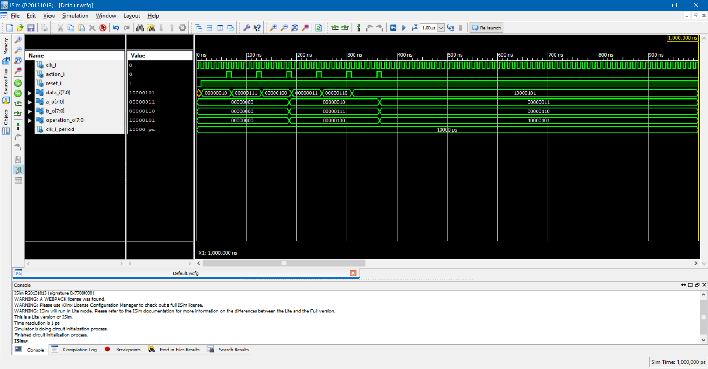

[](https://www.vutbr.cz/en/)

# Notes - semester project
Implementation of ALU (arithmetic logic unit)

#### Task:

  >Vlastní ALU (Arithmetic Logic Unit) jednotka. Možnost výběru instrukcí a vstupních hodnot za chodu aplikace. Výstup na 7segmentovém displeji.

## Problem analysis
ALU (arithmetic logic unit) is a combinatorial logic unit witch do mathematical operations,  usually is used part of processor. All ALU must be implemented partially sequentially for reasons that would be huge. For study purposes, we also decided to implement it sequentially too.

#### Simple operations
Simple ALU should by able to do this instructions:[[1]]

\(C code is demonstration how to this instructions should work)

  - add - sum two numbers
  ```c
    int8_t sum(int8_t A, int8_t B){
      return(A+B);
    }
  ```

  - sub - subtraction two numbers
  ```c
    int8_t sub(int8_t A, int8_t B){
      return(A-B);
    }
  ```
  - and - binary and two numbers
  ```c
    int8_t and(int8_t A, int8_t B){
      return(A&B);
    }
  ```
  - or - binary or two numbers
  ```c
    int8_t or(int8_t A, int8_t B){
      return(A|B);
    }
  ```
  - slt - Compare two numbers *FOR YOURE IMPLEMENTATION IS NOT NECESSARY*
  ```c
    int8_t sum(int8_t A, int8_t B){
      if(A < B){
        return(1);
      }
      return(0);
    }
  ```

#### Control instructions

Our assignment of operations to control signals.

| **Instruction** | **Set of control bits** |
| :-: | :-: |
| **ADD** | 00 |
| **SUB** | 01 |
| **bin AND** | 10 |
| **bin OR** | 11 |

#### EXAMPLE of control instructions

| **Instruction** | SW 7 | SW 6 | SW 5 | SW 4 | SW 3 | SW 2 | SW 1 | SW 0 |
| :-: | :-: | :-: | :-: | :-: | :-: | :-: | :-: | :-: |
| **ADD** | X | X | X | X | X | X | 0 | 0 |
| **SUB** | X | X | X | X | X | X | 0 | 1 |
| **bin AND** | X | X | X | X | X | X | 1 | 0 |
| **bin OR** | X | X | X | X | X | X | 1 | 1 |

#### Representation of numbers in ALU
After many hours of study, we decide to use *2`s complement* code.
It brings many benefits. Sum of two signed numbers is easier and subtraction can again be converted to addition, by binary inverting second number and set carry_i to 1.

Let's see a picture[[4]]


# IMPLEMENTATION

#### OUTPUT into 7 segment display
For easier implementation, we used modules from previous LABs.
For this reason, the statement is NOT clear, because we display individual bytes as they are in output. for positive numbers is not so big problem but if we will want display negative member, output will be difficult to read.

~**It is one of the problems that should be solved in the future**~ - **SOLVED**

Output into 7 seg. display is solved as print:

```VHDL


--------------------------------------------------------------------
--             1.           2.           3.           4.
--           -----        -----        -----        -----           
--          |     |      |     |      |     |      |     |
--          |     |      |     |      |     |      |     |
--           -----        -----        -----        -----
--          |     |      |     |      |     |      |     |
--          |     |      |     |      |     |      |     |        
--           -----        -----        -----        -----        
--          TOP VIEW
--------------------------------------------------------------------

```  

- 1. digit - show NULL or only g segment as minus
- 2. digit - show only NULL
- 3. digit - show 3 the most significant bits as hexadecimal code
- 4. digit - show last 4 bit of answer as hexadecimal code


#### OUTPUT into 5 LEDs
The next output is 5 LEDs, each of which signals the other outputs, in order Carry-out Output, Zero Output, Negative Output, Overflow Output and Parity bit.
(HIGH value is active)

  - Carry-out - sum of two numbers is bigger then max value of output number
  - Zero - output value from ALU is equal to 0
  - Negative - output value from ALU is negative
  - Overflow - output value from ALU is NOT true, value has been Overflow
  - Parity bit - get parity bit from output value (odd parity)

The most interesting of these is the test of Overflow[[5]]


## Sequential implementation

#### Possibility of use Sequential READER
~Sequential READER can be placed in top.vhdl. It is able to read 3 bytes in a row (reads in rising_edge), Number_A, Number_B and operation (you can decide witch 2 bits will use for oper.)~

Sequential READER is used in top.vhdl module where it expects at the input 3 consecutive bytes, which are separated by an impulse (action_i) which must not be as serviceable as the clock cli_i. (rising edge into action_i reads inputs). This circuit remembers the entered values until they are replaced by others.

Let's see test
#### TEST of Sequential READER


#### Control of Sequential READER
In the top file is action_i signal connected into state machine created in file instruction_enable, witch is connected into BTN0. If you push the BTN0, this module will create short impulse for loading data into Sequential READER (input byte of READER is connected into switch(0 to 7)).

#### TEST of generating short impulse for Sequential READER by instruction_enable


#### EXAMPLE of INPUT values

| **Byte order** | SW 7 | SW 6 | SW 5 | SW 4 | SW 3 | SW 2 | SW 1 | SW 0 | dec. number |
| :-: | :-: | :-: | :-: | :-: | :-: | :-: | :-: | :-: | :-: |
| **number A** | 0 | 0 | 0 | 0 | 0 | 1 | 0 | 1 | 5 |
| **number B** | 1 | 1 | 1 | 1 | 1 | 1 | 1 | 1 | -1 |
| **number of oper.** | X | X | X | X | X | X | 0 | 0 |

**Each byte is separated by pushing BTN0**


#### Schematic of TOP module


## SIMULATIONS

#### Test of FULL ADDER block

#### Test of 8bit adder with control input signal

#### Test of final ALU


## SIMULATIONS WITCH LOOKS NICE BUT CAN NOT BE COMPILED (build for Isim is different to desk)

#### Creating 8 bit signed number decoder to decimals into 7 seg. display
###### first number of MOD operation must be multiple of 2 :(
###### first number of / operation must be multiple of 2 :( the same problem


## Resources
\[1] [https://cw.fel.cvut.cz/old/_media/courses/a0b36apo/lectures/02/a0b36apo_prednaska02_2014.pdf](https://cw.fel.cvut.cz/old/_media/courses/a0b36apo/lectures/02/a0b36apo_prednaska02_2014.pdf)

\[2] [http://www.mrc.uidaho.edu/mrc/people/jff/digital/MIPSir.html](http://www.mrc.uidaho.edu/mrc/people/jff/digital/MIPSir.html)

\[3] [https://en.wikipedia.org/wiki/Arithmetic_logic_unit](https://en.wikipedia.org/wiki/Arithmetic_logic_unit)

\[4] [https://minnie.tuhs.org/CompArch/Tutes/week02.html](https://minnie.tuhs.org/CompArch/Tutes/week02.html)

\[5] [https://circuitverse.org/simulator](https://circuitverse.org/simulator)

\[6] [https://www.bitweenie.com/listings/vhdl-type-conversion/](https://www.bitweenie.com/listings/vhdl-type-conversion/)

\[7] [https://moodle.vutbr.cz/pluginfile.php/183804/mod_resource/content/1/vhdl_kubicek.pdf](https://moodle.vutbr.cz/pluginfile.php/183804/mod_resource/content/1/vhdl_kubicek.pdf)


[1]: https://cw.fel.cvut.cz/old/_media/courses/a0b36apo/lectures/02/a0b36apo_prednaska02_2014.pdf
[2]: http://www.mrc.uidaho.edu/mrc/people/jff/digital/MIPSir.html
[3]: https://en.wikipedia.org/wiki/Arithmetic_logic_unit
[4]: https://minnie.tuhs.org/CompArch/Tutes/week02.html
[5]: https://circuitverse.org/simulator
[6]: https://www.bitweenie.com/listings/vhdl-type-conversion/
[7]: https://moodle.vutbr.cz/pluginfile.php/183804/mod_resource/content/1/vhdl_kubicek.pdf
