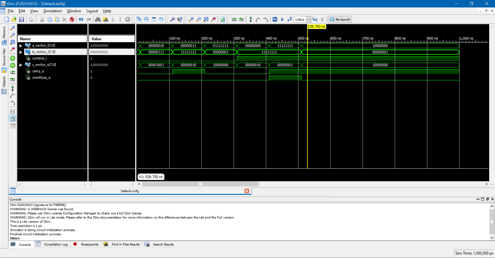

[](https://www.vutbr.cz/en/)

# Notes - semester project
Implementation of ALU (arithmetic logic unit)

#### Task:

  >Vlastní ALU (Arithmetic Logic Unit) jednotka. Možnost výběru instrukcí a vstupních hodnot za chodu aplikace. Výstup na 7segmentovém displeji.

## Problem analysis
ALU (arithmetic logic unit) is a combinatorial logic unit witch do mathematical operations,  usually is used part of processor. All ALU must be implemented partially sequentially for reasons that would be huge. For study purposes, we also decided to implement it sequentially too.

Simple ALU should by able to do this instructions:[[1]](1)

\(C code is demonstration how to this instructions should work)

  - add - sum two numbers
  ```c
    int8_t sum(int8_t A, int8_t B){
      return(A+B);
    }
  ```

  - sub - subtraction two numbers
  ```c
    int8_t sub(int8_t A, int8_t B){
      return(A-B);
    }
  ```
  - and - binary and two numbers
  ```c
    int8_t and(int8_t A, int8_t B){
      return(A&B);
    }
  ```
  - or - binary or two numbers
  ```c
    int8_t or(int8_t A, int8_t B){
      return(A|B);
    }
  ```
  - slt - Compare two numbers *FOR YOURE IMPLEMENTATION IS NOT NECESSARY*
  ```c
    int8_t sum(int8_t A, int8_t B){
      if(A < B){
        return(1);
      }
      return(0);
    }
  ```

#### Control instructions

Our assignment of operations to control signals.

| **Instruction** | **Set of control bits** |
| :-: | :-: |
| **ADD** | 00 |
| **SUB** | 01 |
| **bin AND** | 10 |
| **bin OR** | 11 |


#### Representation of numbers in ALU
After many hours of study, we decide to use *2`s complement* code.
It brings many benefits. Sum of two signed numbers is easier and subtraction can again be converted to addition, by binary inverting second number and set carry_i to 1.

Let's see a picture[[4]]


## Implementation


## SIMULATIONS

#### Test of FULL ADDER block

#### Test of 8bit adder with control input signal

#### Test of final ALU


## Resources
\[1] [https://cw.fel.cvut.cz/old/_media/courses/a0b36apo/lectures/02/a0b36apo_prednaska02_2014.pdf](https://cw.fel.cvut.cz/old/_media/courses/a0b36apo/lectures/02/a0b36apo_prednaska02_2014.pdf)

\[2] [http://www.mrc.uidaho.edu/mrc/people/jff/digital/MIPSir.html](http://www.mrc.uidaho.edu/mrc/people/jff/digital/MIPSir.html)

\[3] [https://en.wikipedia.org/wiki/Arithmetic_logic_unit](https://en.wikipedia.org/wiki/Arithmetic_logic_unit)

\[4] [https://minnie.tuhs.org/CompArch/Tutes/week02.html](https://minnie.tuhs.org/CompArch/Tutes/week02.html)


[1]: https://cw.fel.cvut.cz/old/_media/courses/a0b36apo/lectures/02/a0b36apo_prednaska02_2014.pdf
[2]: http://www.mrc.uidaho.edu/mrc/people/jff/digital/MIPSir.html
[3]: https://en.wikipedia.org/wiki/Arithmetic_logic_unit
[4]: https://minnie.tuhs.org/CompArch/Tutes/week02.html
